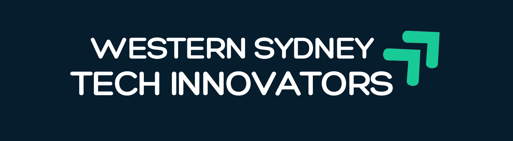

<div align="center">



# 🚀 WSTI Social Media Hub

**AI-powered social media command centre for Western Sydney Tech Innovators**

[](https://app.netlify.com/sites/wsti-social-hub/deploys)


*Transforming event moments into polished, multi-platform social content — powered by Google Gemini AI.*

[🌐 Live App](https://wsti-social-hub.netlify.app) · [📖 Setup Guide](#-getting-started) · [☁️ Netlify Deploy](#option-a--netlify-recommended-for-teams) · [📁 Google Drive Setup](#-google-drive-setup-netlify) · [🐛 Report a Bug](https://github.com/duttabiswanath/wsti-social-hub/issues)

</div>

---

## 📸 What is WSTI Social Media Hub?

The **WSTI Social Media Hub** is a custom-built, browser-based dashboard that helps the **Western Sydney Tech Innovators** volunteer team transform event highlights into ready-to-post social media content — in seconds, not hours.

Instead of manually writing captions, resizing graphics, and copying text across platforms, volunteers simply paste a YouTube link or describe an event. The AI handles everything else: extracting transcripts, generating on-brand captions, creating event imagery, and posting directly to LinkedIn, Instagram, Facebook, and X/Twitter via **Blotato**.

> 💡 Built with love by WSTI volunteers. Zero cost to run — just bring your own API keys.

---

## ✨ Features

| Feature | Description |
|---|---|
| 📝 **AI Post Generator** | Write social posts for any platform using Gemini 2.5 Pro with WSTI's brand voice |
| 🎬 **YouTube Recap** | Paste a YouTube link → auto-extract transcript → generate polished event recap posts |
| 🎨 **AI Graphic Generator** | Create branded event imagery using Google's Nano Banana (Gemini native image model) |
| 🚀 **One-Click Publishing** | Post directly to LinkedIn, Instagram, Facebook, and X/Twitter via Blotato |
| ☁️ **Google Drive Upload** | Save media to Google Drive (works on both local dev and Netlify via Service Account) |
| ⚙️ **In-App Settings** | Manage API keys, platform account IDs, and preferences — stored securely in your browser |
| 🔐 **Protected Login** | Single-user authentication keeps the dashboard private |
| 🩺 **Health Check** | Live status indicator showing connectivity for all APIs |
| 💻 **Local + Cloud** | Run locally with full features, or deploy to Netlify for anywhere-access |

---

## 🛠️ Tech Stack

### Frontend
- 🌐 **Vanilla HTML/CSS/JS** — zero framework dependencies, fast and lightweight
- 🎨 **WSTI Brand Colours** — Navy `#061D2E` · Emerald `#18CB96`
- 🔒 **localStorage** — settings and session data stored client-side (no database needed)

### AI & APIs
- 🤖 **Google Gemini 2.5 Pro** — post generation, transcript extraction, event recaps
- 🎨 **Nano Banana** (`gemini-3.1-flash-image-preview`) — AI image generation, Google's latest native image model
- 📣 **Blotato API** — multi-platform social media scheduling and publishing
- ☁️ **Google Drive API** — media uploads via OAuth (local) or Service Account (Netlify)

### Backend
- ⚡ **Netlify Functions** — serverless Node.js functions, no server to maintain
- 🖥️ **Express.js** — local development server with identical API surface
- 🔧 **Busboy** — multipart form-data parsing for file uploads in serverless functions

---

## 📋 Prerequisites

Before you start, make sure you have:

- ✅ [Node.js 18+](https://nodejs.org/) installed
- ✅ A [Google Gemini API key](https://aistudio.google.com/app/apikey) — free tier is enough to get started
- ✅ A [Blotato account](https://my.blotato.com) with your social accounts connected
- ✅ Your Blotato Account IDs for each platform you want to post to

---

## 🚀 Getting Started

### Option A — Netlify (Recommended for Teams)

> No installation required. Deploy directly from GitHub in under 2 minutes.

1. **Fork** this repo to your own GitHub account
2. Go to [app.netlify.com](https://app.netlify.com) → **Add new site** → **Import an existing project**
3. Connect **GitHub** → select **`wsti-social-hub`**
4. Leave all build settings as-is — they're pre-configured in `netlify.toml`
5. Click **Deploy site** 🎉

Your app is live in ~60 seconds. No environment variables needed to start — enter API keys inside the app's Settings panel after login.

**Want Google Drive on Netlify?** → See the [Google Drive Setup](#-google-drive-setup-netlify) section below.

---

### Option B — Local Development

Best for development, testing, or if you want OAuth-based Google Drive integration.

#### 1. Clone the repo

```bash
git clone https://github.com/duttabiswanath/wsti-social-hub.git
cd wsti-social-hub
```

#### 2. Install dependencies

```bash
npm install
```

#### 3. Configure environment variables

```bash
cp .env.example .env
```

Open `.env` and add your keys:

```env
GEMINI_API_KEY=AIza...
GEMINI_MODEL=gemini-2.5-pro
IMAGEN_MODEL=gemini-3.1-flash-image-preview
BLOTATO_API_KEY=blotato_...
```

> You can also skip the `.env` file entirely and enter keys inside the app's Settings panel after login.

#### 4. (Optional) Set up Google Drive — OAuth for local dev

> Skip this if you're not using Google Drive locally.

1. Go to [Google Cloud Console](https://console.cloud.google.com/) → create or select a project
2. Navigate to **APIs & Services** → **Library** → enable **Google Drive API**
3. Go to **Credentials** → **+ Create Credentials** → **OAuth 2.0 Client ID** (Desktop app)
4. Download the credentials as `credentials.json` and place it in the project root
5. Start the app — on first run, follow the terminal link to authorise Google access
6. A `token.json` file is saved automatically for future sessions

#### 5. Start the development server

```bash
npm start
# or for hot-reload:
npm run dev
```

#### 6. Open the dashboard

```
http://localhost:3000
```

---

## 🔐 First Login

When you open the app (local or Netlify), a login screen appears before the dashboard.

> Credentials are managed by your WSTI admin. Contact your team lead if you need access.

Once logged in, go to ⚙️ **Settings** to enter your API keys and Blotato account IDs. Everything is saved in your browser — no server-side accounts required.

---

## 🗂️ Project Structure

```
wsti-social-hub/
│
├── 📄 wsti-dashboard.html           # Main single-page app
├── 🖼️  wsti-logo.png                # WSTI brand logo (original)
├── 🖼️  wsti-logo-dark.png           # WSTI brand logo (navy background, for README)
│
├── 🖥️  server.js                    # Express server (local development)
├── 📦 package.json
├── 🔧 netlify.toml                  # Netlify build & redirect configuration
├── 🔒 .env.example                  # Environment variable template
└── 🚫 .gitignore
│
└── ⚡ netlify/
    └── functions/
        ├── generate.js              # POST /api/generate          → AI post generation
        ├── generate-recap.js        # POST /api/generate-recap    → Event recap from transcript
        ├── generate-graphic-ai.js   # POST /api/generate-graphic-ai → AI image (Nano Banana)
        ├── transcript.js            # POST /api/transcript        → YouTube transcript extraction
        ├── upload-media.js          # POST /api/upload-media      → Google Drive upload (Service Account)
        ├── post.js                  # POST /api/post              → Publish via Blotato
        ├── accounts.js              # POST /api/accounts          → Blotato connected accounts
        └── health.js                # GET  /api/health            → API status check
```

---

## 🔑 Environment Variables

> 💡 **You don't need a `.env` file to use this app.**
> API keys can be entered directly inside the ⚙️ **Settings** panel — they're stored in your browser and sent securely with every request. The `.env` file is only needed if you prefer server-side key storage for local development.

### 🤖 AI Keys

| Variable | Required? | Description |
|---|---|---|
| `GEMINI_API_KEY` | Optional fallback | Google Gemini API key — [get one free](https://aistudio.google.com/app/apikey). Can be entered in-app instead. |
| `GEMINI_MODEL` | No | Text generation model. Default: `gemini-2.5-pro` |
| `IMAGEN_MODEL` | No | Image generation model. Default: `gemini-3.1-flash-image-preview` |

### 📣 Blotato (Social Publishing)

| Variable | Required? | Description |
|---|---|---|
| `BLOTATO_API_KEY` | Optional fallback | Blotato API key — [get from your dashboard](https://my.blotato.com). Can be entered in-app instead. |
| `BLOTATO_LINKEDIN_ACCOUNT_ID` | No | Only needed if posting to LinkedIn |
| `BLOTATO_INSTAGRAM_ACCOUNT_ID` | No | Only needed if posting to Instagram |
| `BLOTATO_FACEBOOK_ACCOUNT_ID` | No | Only needed if posting to Facebook |
| `BLOTATO_TWITTER_ACCOUNT_ID` | No | Only needed if posting to X / Twitter |

> ℹ️ Only fill in account IDs for the platforms you actually post to.

### ☁️ Google Drive — Netlify (Service Account)

| Variable | Required? | Description |
|---|---|---|
| `GOOGLE_SERVICE_ACCOUNT_JSON` | ✅ For Drive on Netlify | Full contents of your service account JSON key file |
| `GOOGLE_DRIVE_FOLDER_ID` | ✅ For Drive on Netlify | Folder ID from your Google Drive URL (after `/folders/`) |

### ⚙️ Other

| Variable | Required? | Description |
|---|---|---|
| `PORT` | No | Local server port. Default: `3000` |

---

## 📁 Google Drive Setup (Netlify)

Local development uses **OAuth** (a one-time browser authorisation that saves a `token.json` file). This doesn't work on Netlify because serverless functions have no persistent filesystem.

For Netlify, the app uses a **Service Account** — a Google robot identity that authenticates entirely via a JSON key stored in Netlify's environment variables. No browser login, no token files. It's also the right choice for shared team tools since no individual's Google account is tied to production.

### Step 1 — Create a Service Account

1. Go to [Google Cloud Console](https://console.cloud.google.com/) → select or create a project
2. **APIs & Services** → **Library** → search **Google Drive API** → click **Enable**
3. **APIs & Services** → **Credentials** → **+ Create Credentials** → **Service account**
4. Name it `wsti-drive-uploader` → **Create and Continue** → skip role → **Done**
5. Click on the new service account → go to the **Keys** tab
6. **Add Key** → **Create new key** → **JSON** → **Create**
7. A `.json` file downloads — keep it safe 🔑

### Step 2 — Share your Drive folder with the service account

1. Open the downloaded key file and find the `client_email` field
   - It looks like: `wsti-drive-uploader@your-project.iam.gserviceaccount.com`
2. Open your Google Drive folder in a browser
3. Click **Share** → paste the service account email → set permission to **Editor** → **Send**

### Step 3 — Add credentials to Netlify

1. Netlify site → **Site settings** → **Environment variables** → **Add a variable**
2. **Key:** `GOOGLE_SERVICE_ACCOUNT_JSON` · **Value:** paste the entire contents of the JSON key file
3. **Key:** `GOOGLE_DRIVE_FOLDER_ID` · **Value:** the folder ID from your Drive URL
4. **Trigger a redeploy** for the variables to take effect

> 🔒 **Security:** The service account uses `drive.file` scope — it can only access files it creates. It cannot read, modify, or delete any other files in your Google Drive.

---

## 🤖 AI Models Reference

| Model | Codename | Used For |
|---|---|---|
| `gemini-2.5-pro` | — | Writing social posts, event recaps, YouTube transcript extraction |
| `gemini-3.1-flash-image-preview` | 🍌 Nano Banana | Generating AI background imagery for event graphics |

---

## 🌐 Netlify vs Local — Feature Comparison

| Feature | ☁️ Netlify (Cloud) | 💻 Local (Express) |
|---|---|---|
| AI Post Generation | ✅ Full support | ✅ Full support |
| YouTube Transcript + Recap | ✅ Full support | ✅ Full support |
| AI Image Generation | ✅ Full support | ✅ Full support |
| Blotato Publishing | ✅ Full support | ✅ Full support |
| Google Drive Upload | ✅ Service Account | ✅ OAuth |
| In-App API Key Settings | ✅ Full support | ✅ Full support |

> Both deployment modes offer full feature parity. Google Drive authentication differs — Netlify uses a Service Account JSON key (see setup above), while local uses OAuth browser login.

---

## 🐞 Troubleshooting

<details>
<summary><b>🔴 "Transcript failed" error on YouTube videos</b></summary>

- Make sure the video is **publicly accessible** (not private or unlisted)
- Some videos have **auto-generated captions disabled** — try a different video
- Very long videos (>1 hour) may time out on Netlify's free plan (10-second function limit)
- For long videos, consider running locally where there's no timeout

</details>

<details>
<summary><b>🔴 "Image generation failed" error</b></summary>

- Verify your Gemini API key has access to `gemini-3.1-flash-image-preview` (Nano Banana)
- This model may require **Gemini API billing** to be enabled in your Google Cloud project
- Check the browser's developer console (F12 → Console) for the full error message

</details>

<details>
<summary><b>🔴 Posts not publishing to social platforms</b></summary>

- Confirm **Blotato Account IDs** are correctly entered in the Settings panel
- Make sure the social accounts in Blotato are **connected and active** (not expired or revoked)
- Verify your **Blotato API key** is valid and has posting permissions

</details>

<details>
<summary><b>🔴 Google Drive upload fails on Netlify</b></summary>

- Check that `GOOGLE_SERVICE_ACCOUNT_JSON` is set in Netlify → Site settings → Environment variables
- Make sure you pasted the **entire JSON file content**, not just the key value
- Confirm the **service account email** has been shared on your Drive folder with **Editor** access
- Trigger a **redeploy** after adding environment variables — they don't apply to existing deployments

</details>

<details>
<summary><b>🟡 Health check shows API keys missing</b></summary>

- Go to ⚙️ **Settings** in the dashboard
- Enter your **Gemini API key** and **Blotato API key**
- Click **Save Settings** — keys are stored in your browser's localStorage

</details>

---

## 🤝 Contributing

WSTI Social Media Hub is maintained by WSTI volunteers. Contributions are welcome!

1. Fork the repo
2. Create a feature branch: `git checkout -b feature/amazing-feature`
3. Commit your changes: `git commit -m 'Add amazing feature'`
4. Push to the branch: `git push origin feature/amazing-feature`
5. Open a **Pull Request** and describe what you changed and why

---

## 🏢 About Western Sydney Tech Innovators

**Western Sydney Tech Innovators (WSTI)** is a non-profit AI innovation hub and incubator based in Western Sydney, Australia. We connect founders, developers, and tech enthusiasts to build the future of technology in our community.

🌐 [Website](https://westernsydneytechinnovators.org) · 💼 [LinkedIn](https://linkedin.com/company/western-sydney-tech-innovators) · 📸 [Instagram](https://instagram.com/wstechinnovators)

---

## 📄 License

This project is licensed under the **MIT License** — see the [LICENSE](LICENSE) file for details.

---

<div align="center">

Made with ❤️ by WSTI Volunteers · Western Sydney, Australia 🇦🇺

*Empowering communities through technology.*

</div>
